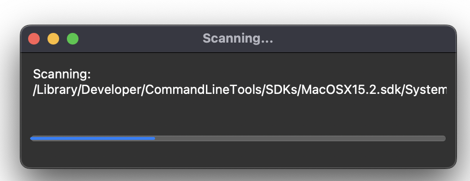
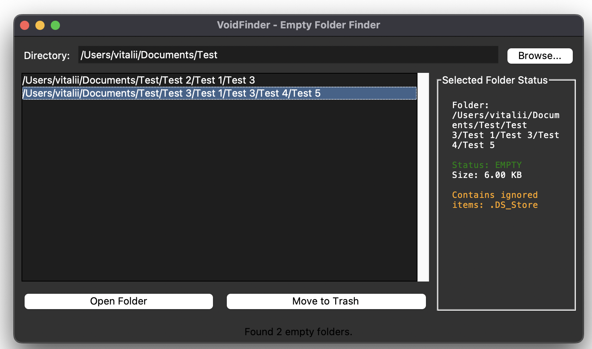
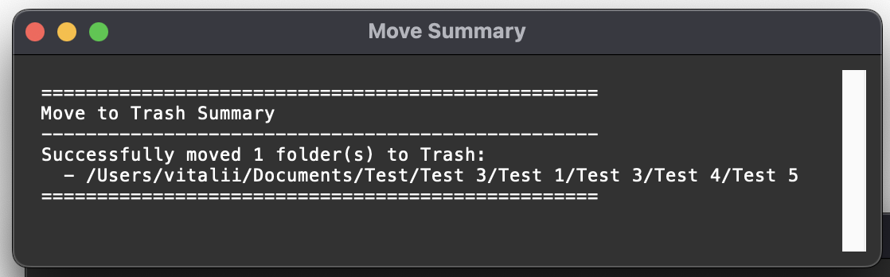
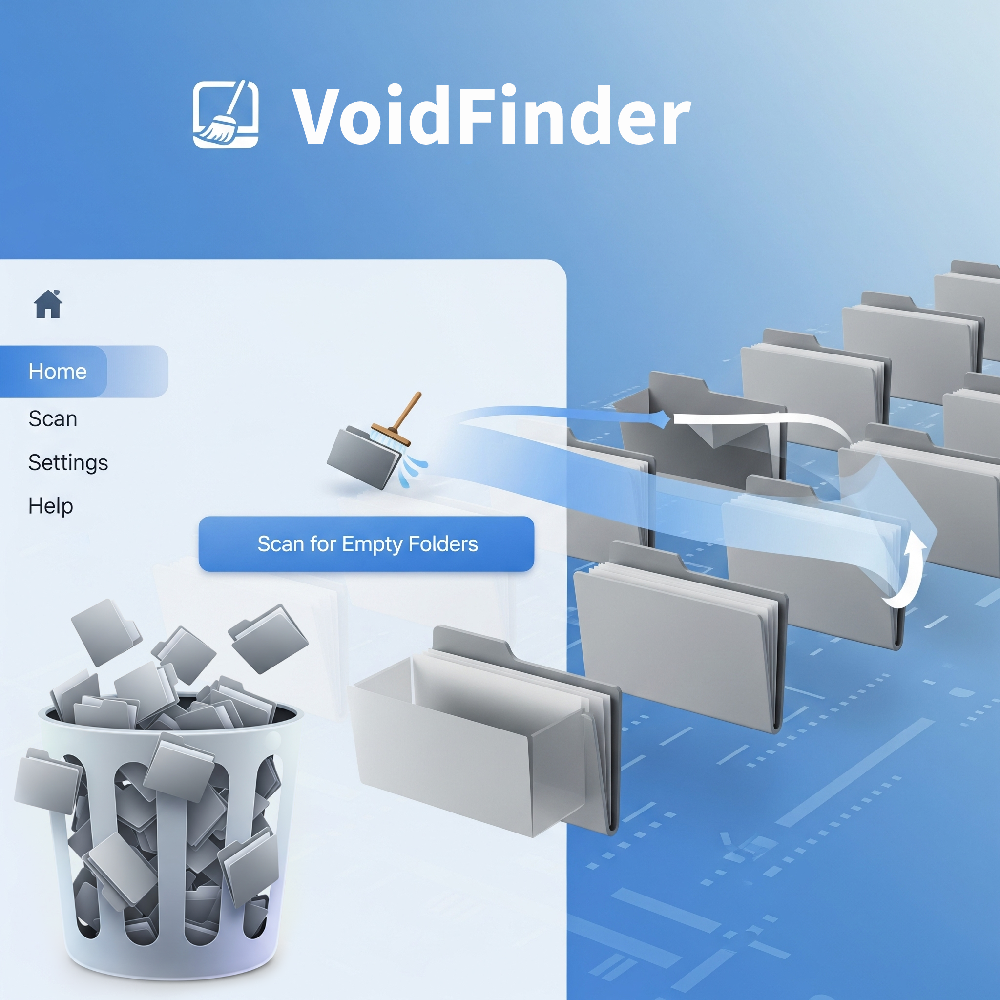

# VoidFinder

A cross-platform GUI utility engineered to identify and safely remove empty directories. The tool intelligently ignores common system-generated files (e.g., macOS's .DS_Store or Windows' Thumbs.db), allowing it to find folders that appear empty to the user. It provides a robust, user-friendly interface for disk cleanup, featuring a non-blocking progress window with a cancellation option 📁💨


<p align="center">  </p>

**➡️ Read more about the project, its features, and development in my [Medium story.](https://medium.com/@starosta/find-and-remove-empty-folders-7360740695dd)** 


## Table of Contents

- [Overview](#overview)
- [Key Features](#key-features)
- [Installation](#installation)
- [Usage](#usage)
- [Project Structure](#project-structure)
- [Development](#development)
- [Known Issues](#known-issues)
- [Contributing](#contributing)
- [License](#license)
- [Contact](#contact)

## Overview

VoidFinder tackles the common problem of disk clutter caused by empty or seemingly empty folders left behind by uninstalled applications or temporary file operations. This tool provides an intuitive graphical interface to scan any directory, identify these empty folders, and move them to the system Trash safely.

The core strength of VoidFinder is its intelligent scanning logic, which ignores system-specific hidden files like .DS_Store and Thumbs.db. The entire operation runs in a background thread, ensuring the application remains responsive even during deep scans. You can monitor its progress in real-time and cancel the operation at any moment.

Problem it Solves:
-   **Disk Clutter:** Finds and removes hundreds or thousands of empty folders left behind by uninstalled applications, temporary processes, or file syncing.
-   **"False" Empties:** Intelligently identifies folders that are technically not empty but contain only invisible system-generated files like .DS_Store (macOS) or Thumbs.db (Windows), making them effectively empty from a user's perspective.
-   **Safety:** Moves folders to the system's Trash/Recycle Bin instead of permanently deleting them, allowing for easy recovery.

A typical workflow involves:
1.	Launching the script and selecting a root directory to scan.
2.	Monitoring the non-blocking progress window, which shows a detailed status and progress bar.
3.	Reviewing the list of identified empty folders in the main window. 
4.	Selecting one or more folders and viewing their details in the status panel.
5.	Choosing to either open a folder in the system's file manager for inspection or move the selected folders to the Trash. 
6.	Receiving a final, copyable summary report detailing the outcome of the deletion process. 


## Key Features

-   **Intelligent Scanning:** Identifies folders that are visually empty by ignoring common system files (.DS_Store, Thumbs.db, etc.).
-   **Non-Blocking GUI:** The entire scanning process runs in a separate thread, keeping the UI fully responsive at all times.
-   **Real-Time Progress Tracking:** A dedicated window shows the current scanning path, a progress bar, and the number of items processed.
-   **Graceful Cancellation:** A "Cancel" button in the progress window allows the user to stop the scan at any point.
-   **Interactive Results List:** Displays all found empty folders in a sortable, multi-selectable list. Supports familiar Command-Click and Command-Shift-Click for multi-folder selection in the results list on macOS.
-   **Safe Deletion:** Moves selected folders to the system Trash using the send2trash library, allowing for easy recovery. 
-   **Confirmation & Summary:** Prompts the user for confirmation before deletion and provides a detailed summary report upon completion.


## Installation

### Prerequisites

-   Python 3.6+
-   A graphical desktop environment is required to run the `tkinter`-based GUI.

### Clone the Repository

```bash
git clone https://github.com/sztaroszta/VoidFinder.git
cd VoidFinder 
```

### Install Dependencies

You can install the required dependency using pip:

```bash
pip install -r requirements.txt
```

*Alternatively, install the dependency manually:*

```bash
pip install send2trash
```

## Usage

**1. Run the application:**

```bash
python empty_folder_finder.py
```

**2. Follow the GUI Prompts:**
*   **Select Directory:** Click the "Browse..." button to choose a starting directory for the scan.
*   **Monitor Progress:** A progress window will appear, showing the status of the scan. You can close this window at any time to cancel.
    <p align="center">  </p>
*   **Review Results:** Once the scan is complete, the main window will populate with a list of empty folders. Click on any folder to see its details in the status panel on the right.
    <p align="center">  </p>
*   **Take Action:**
    *   Select one or more folders from the list.
    *   Click **"Open Folder"** to inspect it in your system's file manager.
    *   Click **"Move to Trash"** to delete the selected folders. You will be asked for confirmation.
*   **View Summary:** After the move operation, a summary window will appear, detailing which folders were successfully moved and which failed. This text is copyable.
    <p align="center">  </p>

## Project Structure

```
VoidFinder/
├── empty_folder_finder.py  # Main script for running the tool
├── README.md               # Project documentation
├── requirements.txt        # List of dependencies
├── .gitignore              # Git ignore file for Python projects
├── assets/                 # Contains screenshots of the application's UI
└── LICENSE                 # GNU AGPLv3 License File
```

## Development

**Guidelines for contributors:**

If you wish to contribute or enhance VoidFinder:
-   **Coding Guidelines:** Follow Python best practices (PEP 8). Use meaningful variable names and add clear comments or docstrings.
-   **Testing:** Before submitting changes, please test them locally on different operating systems (macOS, Windows, Linux) to ensure cross-platform compatibility.
-   **Issues/Pull Requests:** Please open an issue or submit a pull request on GitHub for enhancements or bug fixes.

## Known Issues

-   **Test Environment:** This code has been tested only on macOS. Users running it on Windows or Linux may encounter different behavior.
-   **UI Appearance:** As a Tkinter-based application, the look and feel of the GUI may vary slightly across different operating systems (Windows, macOS, Linux) to match native widget styles.
-   Scanning directories with a very large number of subfolders (e.g., system directories or large network drives) can take a significant amount of time, even with the pre-scan optimization.
-   The application may not be able to scan or delete folders in system-protected locations due to permissions errors. On macOS, the operating system may restrict access to certain user folders (like ~/Documents, ~/Desktop, ~/Downloads). If a scan fails or returns no results in these locations, you may need to grant Full Disk Access to your terminal or the application via System Settings > Privacy & Security > Full Disk Access.


## Contributing

**Contributions are welcome!** Please follow these steps:

1.  Fork the repository.
2.  Create a new branch for your feature or fix.
3.  Commit your changes with descriptive messages.
4.  Push to your fork and submit a pull request.

For major changes, please open an issue first to discuss the proposed changes.

## License

Distributed under the GNU Affero General Public License v3 (AGPLv3) License.
See [LICENSE](LICENSE) for full details.


## Contact

For questions, feedback, or support, please open an issue on the [GitHub repository](https://github.com/sztaroszta/VoidFinder/issues) or contact me directly: 

[](https://www.linkedin.com/in/vitalii-starosta)
[](https://github.com/sztaroszta)
[](https://gitlab.com/sztaroszta)
[](https://bitbucket.org/sztaroszta/workspace/overview)
[](https://gitea.com/starosta) 

Project Showcase: [sztaroszta.github.io](https://sztaroszta.github.io)

```
Send those empty folders into the void! 🔥🕳️
```

**Version:** 5  
**Concept Date:** 2025-05-06 

<p align="left"> </p>
